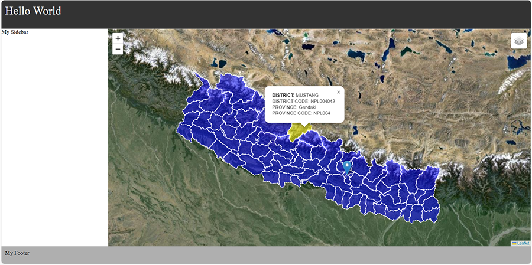

### Click anywhere on the map to get its lat lon.

Open your `map.js` file and Add the following leaflet code:

```javascript
var popup = L.popup();

function onMapClick(e) {
	popup.setLatLng(e.latlng).setContent("You clicked the map at " + e.latlng.toString()).openOn(map);
}
map.on('click', onMapClick);
```

### layercontrols.
This will show you how to group several layers into one, and how to use the layers control to allow users to easily switch different layers on your map.


```javascript
var osm = L.tileLayer('https://tile.openstreetmap.org/{z}/{x}/{y}.png', {
	attribution: '&copy; <a href="http://www.openstreetmap.org/copyright">OpenStreetMap</a>'
});

var osmHOT = L.tileLayer('https://{s}.tile.openstreetmap.fr/hot/{z}/{x}/{y}.png', {
	attribution: '&copy; <a href="https://www.openstreetmap.org/copyright">OpenStreetMap</a> contributors, Tiles style by <a href="https://www.hotosm.org/" target="_blank">Humanitarian OpenStreetMap Team</a> hosted by <a href="https://openstreetmap.fr/" target="_blank">OpenStreetMap France</a>'
});

var map = L.map('map', {
	center: [27.68723120070982, 85.32372326123497],
	zoom: 19,
	layers: [osm]
});

var baseLayers = {
	'OpenStreetMap': osm,
	'OpenStreetMap.HOT': osmHOT
};

var layerControl = L.control.layers(baseLayers).addTo(map);
```

Add google images on the above.

Satellite:

```javascript
var googleSat = L.tileLayer('http://{s}.google.com/vt/lyrs=s&x={x}&y={y}&z={z}',{
        subdomains:['mt0','mt1','mt2','mt3']

layerControl.addBaseLayer(googleSat, 'Satellite Image');
```

Hybrid
```javascript
var googleHybrid = L.tileLayer('http://{s}.google.com/vt/lyrs=s,h&x={x}&y={y}&z={z}',{
        subdomains:['mt0','mt1','mt2','mt3']
});

layerControl.addBaseLayer(googleHybrid, 'Hybrid');
```

streets
```javascript
var googleStreets = L.tileLayer('http://{s}.google.com/vt/lyrs=m&x={x}&y={y}&z={z}',{
        subdomains:['mt0','mt1','mt2','mt3']
});

layerControl.addBaseLayer(googleStreets, 'streets');
```

Terrain
```javascript
googleTerrain = L.tileLayer('http://{s}.google.com/vt/lyrs=p&x={x}&y={y}&z={z}',{
        subdomains:['mt0','mt1','mt2','mt3']
});

layerControl.addBaseLayer(googleTerrain, 'Terrain');
```

Geojson file in Leaflet
Lets add District of Nepal in your current workspace, that reads from a GeoJSON file using JQuery.



### Part 1: Copy Nepal.json file in the same directory as your index file.

### Part 2: Using Jquery.
We can read the Geojson file using the jQuery library  using the followign script.

Put the following code in the `<head>` area of your `index.html` file.

```html
<script src="https://ajax.googleapis.com/ajax/libs/jquery/2.2.0/jquery.min.js"></script>
```
### Part 3: Create style
```javascript
// Set style function that sets fill color property
function style(feature) {
    return {
        fillColor: 'blue',
        fillOpacity: 0.5,
        weight: 2,
        opacity: 1,
        color: '#ffffff',
        dashArray: '3'
    };
}
    var highlight = {
        'fillColor': 'yellow',
        'weight': 2,
        'opacity': 1
    };
```

### Part 4: Javascript
write a function to display in popup about the contents of District
```javascript
function forEachFeature(feature, layer) {

	var popupContent = "<p><b>DISTRICT: </b>"+ feature.properties.ADM2NM_1 +
		"</br>DISTRICT CODE: "+ feature.properties.ADM2CD +
		"</br>PROVINCE: "+ feature.properties.ADM1NM +
		"</br>PROVINCE CODE: "+ feature.properties.ADM1CD +'</p>';

	layer.bindPopup(popupContent);

	layer.on("click", function (e) {
		theLayer.setStyle(style); //resets layer colors
		layer.setStyle(highlight);  //highlights selected.
	});
}	
```
### Part 5: Adding Data to the Layer
```javascript
// Null variable that will hold layer
var theLayer = L.geoJson(null, {onEachFeature: forEachFeature, style: style});

$.getJSON(url, function(data) {
	theLayer.addData(data);
});

theLayer.addTo(map);
```
### Part 6: create a layer control that allows to switch the overlay maps ((in this case, the district boundary layer).
```javascript
var overlayMaps = {
    "District Boundary":theLayer
};
```
### Part 7: Adding the Layer Control to the Map: 
```javascript
var layerControl = L.control.layers(baseLayers, overlayMaps).addTo(map);
```
